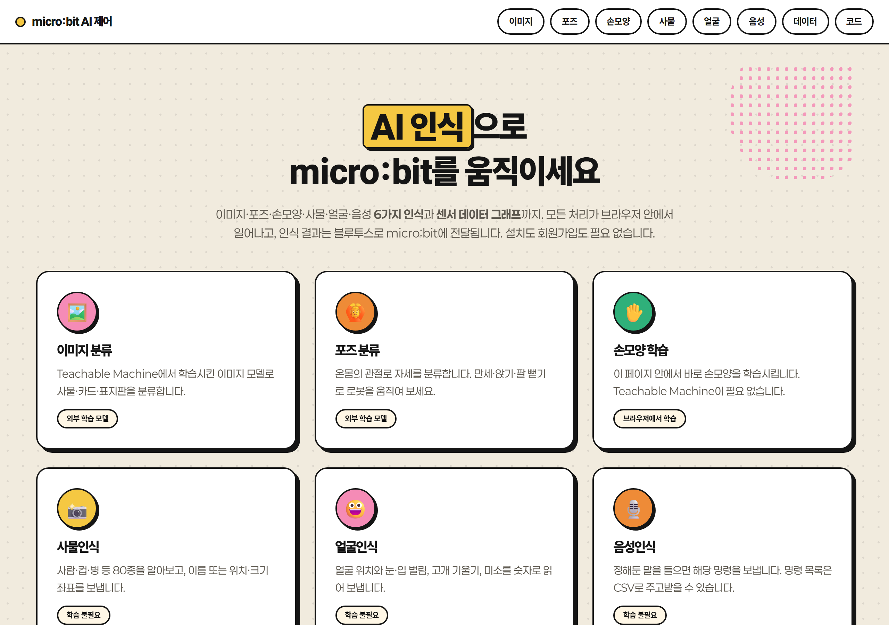
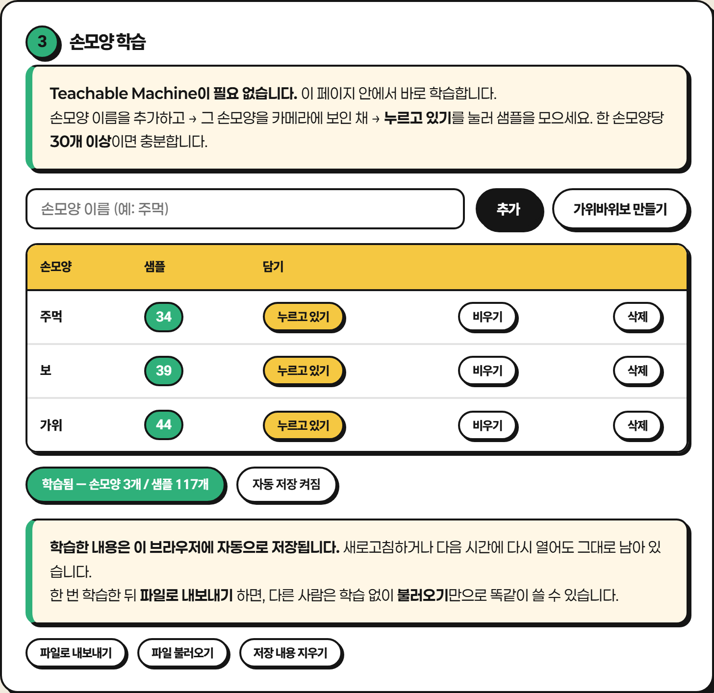
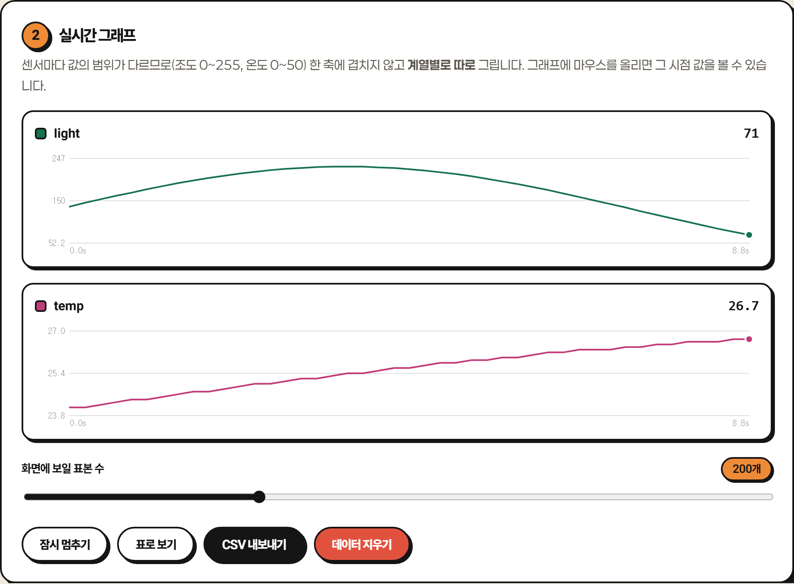

# micro:bit AI 제어

브라우저에서 동작하는 AI 인식으로 micro:bit를 제어하는 교육용 웹앱입니다.
이미지·포즈·손모양·사물·얼굴·음성 6가지 인식과 센서 데이터 시각화를 제공하며,
인식 결과를 Web Bluetooth(UART)로 micro:bit에 전달합니다.

**[▶ 바로 사용하기](https://qksrhrrltnf-ctrl.github.io/microbit-ai-control/)**



## 목차

- [기능](#기능) · [동작 방식](#동작-방식) · [시작하기](#시작하기)
- [통신 규약](#통신-규약) · [저장 방식](#저장-방식)
- [사용 환경](#사용-환경) · [직접 배포하기](#직접-배포하기) · [구조](#구조)

## 기능

| 페이지 | 인식 대상 | 모델 학습 | micro:bit로 전송 |
|---|---|---|---|
| `index.html` | — | — | 허브 (시작 안내 · 환경 확인) |
| `image.html` | 카메라 영상 분류 | Teachable Machine | 매핑한 명령어 |
| `pose.html` | 전신 자세 분류 | Teachable Machine | 매핑한 명령어 |
| `handpose.html` | 손 모양 분류 | **브라우저 내 학습** | 매핑한 명령어 |
| `object.html` | 사물 80종 | 사전 학습 모델 | 좌표 패킷 또는 사물 이름 |
| `face.html` | 얼굴·표정 | 사전 학습 모델 | 얼굴 패킷 |
| `voice.html` | 음성 명령 | 불필요 | 매핑한 명령어 |
| `streamer.html` | — | — | *(수신 전용)* 센서값 그래프 · CSV |
| `microbit/` | — | — | MakeCode 예제 6종 · 통신 규약 |

### 손모양 학습 — 외부 서비스 없이 브라우저에서 완결

MediaPipe로 추출한 손 관절 좌표를 KNN으로 분류합니다.
손목 기준 상대좌표를 손 크기로 정규화하므로 화면상 위치와 거리에 영향받지 않습니다.



### 데이터 스트리머 — micro:bit → 웹 방향

센서마다 값의 범위가 다르므로 한 축에 겹쳐 그리지 않고 계열별로 분리해 표시합니다.



## 동작 방식

```
카메라 / 마이크 ──▶ AI 인식 ──▶ 결과 + 확률
                                    │
                신뢰도 기준 · 연속 확인으로 필터링
                                    │
                      결과 → 명령어 매핑
                                    │
          Web Bluetooth (UART) ──▶ micro:bit
```

서버를 거치지 않습니다. 영상과 음성은 기기 안에서만 처리되며,
micro:bit로 나가는 것은 짧은 문자열뿐입니다.
(음성인식만 브라우저가 제공하는 인식 서비스를 이용하므로 인터넷 연결이 필요합니다.)

### 설계상의 선택

- **클래스명과 전송 명령의 분리** — 클래스는 한글로 지어도 되고, micro:bit로는 매핑 표에서 정한 짧은 영문 명령이 나갑니다. UART로 한글을 보내면 깨지는 문제를 우회합니다.
- **신뢰도 기준 + 연속 확인** — 최고 확률이 기준을 넘고 같은 결과가 N회 연속 나와야 확정합니다. 기본 전송 정책은 *결과가 바뀔 때만* 이므로 매 프레임 전송으로 통신이 포화되지 않습니다.
- **연습 모드** — micro:bit 연결 없이 인식 결과와 전송될 명령을 확인할 수 있습니다.
- **전송 기록** — 전송 시각과 내용이 화면에 남아 동작 확인과 문제 추적에 사용됩니다.

## 시작하기

### 1. micro:bit 준비

[`microbit/`](microbit/) 페이지의 예제를 MakeCode에 붙여넣고 다운로드합니다.

> **필수 설정 두 가지**
> - 프로젝트 설정에서 **No Pairing Required** 를 켭니다. 끄면 매번 페어링이 필요합니다.
> - 무선(Radio) 블록은 블루투스와 함께 사용할 수 없으므로 제거합니다.

### 2. 기능 선택

모델 학습이 필요 없는 **사물·얼굴·음성** 인식이 가장 빠르게 시작할 수 있습니다.
직접 학습시키려면 **손모양**(브라우저 내 학습) 또는
**이미지·포즈**([Teachable Machine](https://teachablemachine.withgoogle.com/) 모델 로드)를 사용합니다.

### 3. 실행

카메라 → 블루투스 → 모델 순서로 진행한 뒤 시작 버튼을 누릅니다.
브라우저가 카메라 또는 마이크 권한을 요청합니다.

## 통신 규약

micro:bit 표준 UART 서비스를 사용합니다. 1회 전송 한도는 **20바이트**입니다.

| 특성 | UUID |
|---|---|
| Service | `6E400001-B5A3-F393-E0A9-E50E24DCCA9E` |
| TX (micro:bit → 웹, notify) | `6E400002-B5A3-F393-E0A9-E50E24DCCA9E` |
| RX (웹 → micro:bit, write) | `6E400003-B5A3-F393-E0A9-E50E24DCCA9E` |

### 웹 → micro:bit

```
rock\n                  분류 결과 — 매핑 표에서 정한 명령어
person\n                사물 이름 (사물인식 · 이름 모드)
x200y150w080h060n02\n   사물 좌표 — 중심 x·y, 크기 w·h, 개수 n
x50y42m30a90b88r5s2\n   얼굴 값 — 위치 x·y, 입 m, 왼눈 a, 오른눈 b, 기울기 r, 미소 s
stop\n                  인식 중지 또는 대상 소실 시
```

좌표·얼굴 패킷은 식별 문자 뒤에 고정 자릿수의 숫자가 붙는 형식이며,
micro:bit에서는 `substr`로 잘라 사용합니다. [파싱 예제](microbit/#object)를 참고하세요.

### micro:bit → 웹 (데이터 스트리머)

```
light=123\n             이름과 값
light=123,temp=25\n     한 줄에 여러 값
123\n                   이름을 생략하면 value로 기록
```

## 저장 방식

학습 결과와 설정은 **브라우저의 localStorage**에 저장되며 기기 밖으로 전송되지 않습니다.
서버나 데이터베이스를 사용하지 않습니다.

| 페이지 | 저장 항목 |
|---|---|
| 손모양 | 손모양 목록 · KNN 학습 샘플 · 명령 매핑 · 인식 설정 |
| 음성 | 명령어 목록 · 인식 언어 · 매칭 방식 · 재전송 간격 |
| 이미지 · 포즈 | 모델 주소 · 명령 매핑 · 인식 설정 |
| 사물 · 얼굴 | 전송 방식 · 추적 대상 · 신뢰도 · 전송 간격 |
| 데이터 | 표시 표본 수 |

새로고침이나 브라우저 재시작 후에도 유지되며, 각 페이지의 **저장 내용 지우기** 로 초기화합니다.

### 학습 결과 배포

손모양 학습은 JSON 파일로 내보내고 불러올 수 있습니다.
한 번 학습한 결과를 `handpose-training.json` 으로 내보내 배포하면,
받는 쪽은 불러오기만으로 동일한 분류기를 사용합니다. 불러온 내용도 자동 저장됩니다.

> localStorage 한도는 약 5MB이며, 손모양 샘플 50개가 약 40KB입니다.
> 시크릿 모드 등 저장이 차단된 환경에서는 그 사실이 화면에 표시됩니다.
> 한 대의 컴퓨터를 여러 사용자가 공유하면 저장 내용도 공유됩니다.

## 사용 환경

| 환경 | 지원 |
|---|---|
| Chrome / Edge (Windows · macOS · Android · ChromeOS) | 지원 |
| iOS Safari | 미지원 — [Bluefy](https://apps.apple.com/app/id1492822055) 브라우저 필요 |
| Firefox | 미지원 |

- Web Bluetooth는 **HTTPS 또는 localhost**에서만 동작합니다. GitHub Pages는 HTTPS를 기본 제공합니다.
- micro:bit v1·v2 모두 동작하나, 블루투스와 확장 블록을 함께 쓸 경우 메모리 여유가 있는 **v2**를 권장합니다.
- 카메라 또는 마이크 권한이 필요하며, 사물·얼굴·손모양 인식은 첫 실행 시 모델 파일(수 MB)을 내려받습니다.

## 직접 배포하기

빌드 과정이 없으므로 저장소를 그대로 올리면 됩니다.

```bash
git clone https://github.com/qksrhrrltnf-ctrl/microbit-ai-control.git
cd microbit-ai-control
git remote set-url origin https://github.com/<사용자명>/<저장소명>.git
git push -u origin main
```

저장소 **Settings → Pages → Source: `main` / `(root)`** 로 설정하면
`https://<사용자명>.github.io/<저장소명>/` 에서 열립니다.
저장소가 **Public** 이어야 GitHub Pages를 사용할 수 있습니다.

### 로컬 실행

`file://` 로 열면 카메라·마이크·블루투스가 차단되므로 로컬 서버를 사용합니다.

```bash
python -m http.server 8000
```

`http://localhost:8000` 으로 접속합니다.

## 구조

```
├── index.html            허브
├── image.html            이미지 분류
├── pose.html             포즈 분류
├── handpose.html         손모양 학습
├── object.html           사물인식
├── face.html             얼굴인식
├── voice.html            음성인식
├── streamer.html         데이터 스트리머
├── microbit/index.html   MakeCode 예제 · 통신 규약
├── css/style.css         디자인 시스템
└── js/
    ├── microbit-ble.js   Web Bluetooth (UART) 코어
    ├── core.js           공용 부품 — 로그 · 카메라 · 매핑 · 전송 정책 · 푸터
    ├── store.js          localStorage 저장 · 파일 입출력
    ├── model-runner.js   Teachable Machine 모델 로더
    ├── knn.js            손 특징 추출 · KNN 분류 (순수 계산)
    ├── app.js            이미지 · 포즈
    ├── handpose.js       손모양 학습
    ├── object.js         사물인식
    ├── face.js           얼굴인식
    ├── voice.js          음성인식
    ├── streamer.js       데이터 스트리머
    └── ui.js             스크롤 연출
```

모든 기능 페이지가 [`js/core.js`](js/core.js)의 공용 부품을 공유하므로
BLE 연결·카메라·매핑 표·전송 정책은 한 곳에서 관리됩니다.
`image.html`과 `pose.html`은 같은 [`js/app.js`](js/app.js)를 사용하며
`<body data-mode="image|pose">` 로 동작 모드만 구분합니다.

[`js/knn.js`](js/knn.js)는 DOM에 의존하지 않는 순수 계산 모듈이므로 단독으로 테스트할 수 있습니다.

### 제작자 표기 변경

[`js/core.js`](js/core.js) 상단의 `CREDIT` 값을 수정하면 모든 페이지 푸터에 반영됩니다.

```javascript
var CREDIT = {
  author: '이름',
  githubUrl: 'https://github.com/아이디/저장소'
};
```

## 사용 기술

프레임워크와 빌드 도구를 사용하지 않은 순수 HTML · CSS · JavaScript입니다.

| 용도 | 라이브러리 |
|---|---|
| 손·사물·얼굴 인식 | [MediaPipe Tasks Vision](https://ai.google.dev/edge/mediapipe) (Apache-2.0) |
| 이미지·포즈 분류 | [@teachablemachine/image](https://github.com/googlecreativelab/teachablemachine-community), [@teachablemachine/pose](https://github.com/googlecreativelab/teachablemachine-community) (Apache-2.0) |
| 모델 실행 | [TensorFlow.js](https://www.tensorflow.org/js) (Apache-2.0) |
| 기기 통신 | [Web Bluetooth API](https://webbluetoothcg.github.io/web-bluetooth/) |
| 음성 인식 | [Web Speech API](https://wicg.github.io/speech-api/) |
| 서체 | [페이퍼로지](https://noonnu.cc/font_page/1099), [프리젠테이션](https://noonnu.cc/font_page/1010) (OFL) |

## 라이선스

[MIT License](LICENSE)
